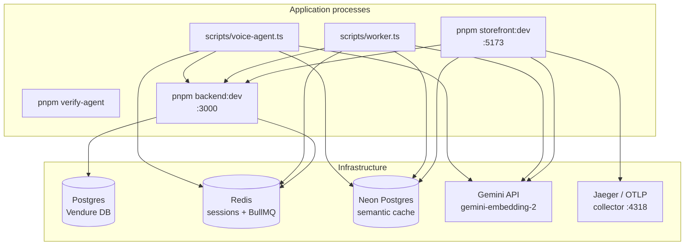

## Local Demo Runbook — Full Stack + Telemetry

Use this guide when you need to **demo the full distributed loop** on one machine: Vendure commerce, Remix storefront + concierge, Redis session memory, Neon semantic cache, optional WhatsApp/voice transports, and OTLP trace collection.

For secret placement only, see [environment-config.md](./environment-config.md). For a one-line env copy command, see [ENV.md](../../ENV.md).

---

### 1. What You Are Starting



| # | Terminal | Command | Required for demo |
| --- | --- | --- | --- |
| 0 | — | Infrastructure (Postgres, Redis, Jaeger) | Yes (except Jaeger = telemetry only) |
| 1 | A | `pnpm verify-agent` | Recommended |
| 2 | B | `pnpm backend:dev` | Yes |
| 3 | C | `pnpm storefront:dev` | Yes |
| 4 | D | `node --no-warnings --experimental-strip-types scripts/worker.ts` | WhatsApp demo only |
| 5 | E | `node --no-warnings --experimental-strip-types scripts/voice-agent.ts dev` | Voice demo only |

---

### 2. Prerequisites

| Dependency | Version / notes |
| --- | --- |
| Node.js | `>= 20` |
| pnpm | `10.x` (see root `packageManager`) |
| Postgres | Local `vendure` database, or Neon `medusa` project — see [environment-config.md](./environment-config.md) |
| Redis | `redis://localhost:6379` (BullMQ + session store) |
| Gemini API | `EMBEDDING_API_KEY` in `apps/storefront/.env` (same value as backend `GEMINI_API_KEY`) |
| Neon | `PAYLOAD_DATABASE_URL` in `apps/storefront/.env` (semantic cache) |
| DeepSeek API key | `DEEPSEEK_API_KEY` in `apps/storefront/.env` (concierge LLM) |

**Quick infrastructure (Docker, PowerShell):**

```powershell
# Postgres — skip if you already run local Postgres with DB vendure
docker run -d --name aura-postgres `
  -e POSTGRES_PASSWORD=postgres `
  -e POSTGRES_DB=vendure `
  -p 5432:5432 postgres:16

# Redis — required for worker + OrchestratorService sessions
docker run -d --name aura-redis -p 6379:6379 redis:7

# Jaeger (OTLP HTTP on 4318, UI on 16686) — telemetry demo
docker run -d --name jaeger `
  -p 16686:16686 `
  -p 4318:4318 `
  -p 4317:4317 `
  jaegertracing/all-in-one:latest
```

Fill `EMBEDDING_API_KEY` with the same value as `GEMINI_API_KEY` from `apps/backend/.env`.

---

### 3. Environment Files

From repo root:

```powershell
copy apps\backend\.env.template apps\backend\.env
copy apps\storefront\.env.template apps\storefront\.env
copy scripts\.env.template scripts\.env
```

#### Minimum keys for web concierge demo

| File | Keys |
| --- | --- |
| `apps/backend/.env` | `DB_*`, `JWT_SECRET`, `COOKIE_SECRET`, `REDIS_URL=redis://localhost:6379` |
| `apps/storefront/.env` | `VENDURE_API_URL=http://localhost:3000/shop-api`, `SESSION_SECRET`, `DEEPSEEK_API_KEY`, `PAYLOAD_DATABASE_URL`, `EMBEDDING_API_KEY`, `OTEL_EXPORTER_OTLP_ENDPOINT=http://localhost:4318/v1/traces` |

#### Add for WhatsApp demo

| File | Keys |
| --- | --- |
| `apps/backend/.env` + `apps/storefront/.env` | `WHATSAPP_VERIFY_TOKEN` (same value in both) |
| `apps/storefront/.env` | `WHATSAPP_APP_SECRET` |
| `scripts/.env` | `WHATSAPP_ACCESS_TOKEN`, `WHATSAPP_PHONE_NUMBER_ID` |

#### Add for voice demo

| File | Keys |
| --- | --- |
| `scripts/.env` | `LIVEKIT_URL`, `LIVEKIT_API_KEY`, `LIVEKIT_API_SECRET`, `DEEPGRAM_API_KEY`, `CARTESIA_API_KEY` |

Root scripts inherit `DB_*`, `DEEPSEEK_API_KEY`, and `PAYLOAD_DATABASE_URL` via [`scripts/load-env.ts`](../../scripts/load-env.ts) — do not duplicate them in `scripts/.env`.

---

### 4. First-Time Data Setup

```powershell
pnpm install
pnpm backend:seed    # resets + seeds Vendure catalog (requires Postgres up)
```

Confirm Vendure is healthy before starting the storefront:

- Shop API: [http://localhost:3000/shop-api](http://localhost:3000/shop-api)
- Admin UI: [http://localhost:3000/admin](http://localhost:3000/admin) (default `superadmin` / `superadmin` from template)

---

### 5. Start Application Processes

Open **separate terminals** from repo root (`I:\aura`).

**Terminal 1 — AST guardrails (recommended):**

```powershell
pnpm verify-agent
```

**Terminal 2 — Vendure backend:**

```powershell
pnpm backend:dev
```

Wait for `Vendure server bootstrapped successfully!`

**Terminal 3 — Remix storefront:**

```powershell
pnpm storefront:dev
```

Storefront: [http://localhost:5173](http://localhost:5173)

**Terminal 4 — WhatsApp worker (optional):**

```powershell
node --no-warnings --experimental-strip-types scripts/worker.ts
```

Expect: worker connected to Redis and listening on BullMQ queue `whatsapp-ingestion`. See [webhook-pubsub.md](./webhook-pubsub.md).

**Terminal 5 — LiveKit voice agent (optional):**

```powershell
node --no-warnings --experimental-strip-types scripts/voice-agent.ts dev
```

See [voice-agent-flow.md](./voice-agent-flow.md).

---

### 6. Telemetry Setup

Aura emits OTLP traces when a collector is reachable at `OTEL_EXPORTER_OTLP_ENDPOINT` (default `http://localhost:4318/v1/traces`).

#### Collector

Start Jaeger (see §2 Docker command), then open the UI:

**[http://localhost:16686](http://localhost:16686)**

Set in `apps/storefront/.env`:

```env
OTEL_EXPORTER_OTLP_ENDPOINT=http://localhost:4318/v1/traces
```

Restart `pnpm storefront:dev` after changing this value.

#### What produces spans today

| Source | Span names / service | Notes |
| --- | --- | --- |
| [`scripts/otel-bootstrap.ts`](../../scripts/otel-bootstrap.ts) | NodeSDK global provider | Bootstrapped at process start in `worker.ts` and `voice-agent.ts` |
| Mastra (`apps/storefront/app/mastra/index.ts`) | `aura-storefront-remix-agents` | Configured for OTLP export; wired when agents run through the `mastra` instance |
| `OrchestratorService` | `context-hydration` | Exported via bootstrap in worker + voice paths |
| `scripts/worker.ts` | `rate-limiter` | Exported via bootstrap on BullMQ job processing |

`scripts/worker.ts` and `scripts/voice-agent.ts` import [`scripts/otel-bootstrap.ts`](../../scripts/otel-bootstrap.ts) before any other modules, registering a global `TracerProvider` with an OTLP HTTP exporter. Start Jaeger before launching worker or voice-agent to capture `context-hydration` and `rate-limiter` spans.

#### Verify telemetry path

1. Start Jaeger (see §2 Docker command).
2. Launch `scripts/worker.ts` or `scripts/voice-agent.ts` (or send a WhatsApp/voice message through the full loop).
3. Jaeger UI → **Search** → look for traces in the last 15 minutes (`context-hydration`, `rate-limiter`).
4. For web concierge: open [http://localhost:5173](http://localhost:5173) → concierge widget → send a message; Mastra OTLP spans appear when agents run through the `mastra` instance.

If no traces appear, confirm Jaeger is running (`docker ps`), port `4318` is not blocked, and `OTEL_EXPORTER_OTLP_ENDPOINT` matches.

---

### 7. Demo Test Scripts

Run from repo root **while infrastructure is up**.

**Semantic cache cycle** (Neon + Gemini embeddings):

```powershell
node --no-warnings --experimental-strip-types scripts/test-cache-cycle.ts
```

Expected output ends with `--- TEST CYCLE SUCCESSFUL ---`.

**Clear semantic cache** (optional reset):

```powershell
node --no-warnings --experimental-strip-types scripts/clear-cache.ts
```

---

### 8. Demo Scenarios

#### A. Web storefront + AI concierge (recommended first demo)

1. Open [http://localhost:5173](http://localhost:5173).
2. Click the **concierge widget** (bottom of homepage).
3. Try:
   - *"Search the catalog for minimalist jackets"*
   - *"What's in my cart?"*
   - *"Show me recommendations"*
4. Tool results render as native product cards (not raw markdown tables).

**Pass criteria:** Agent replies, catalog tools return products, no 500 in the Network tab.

#### B. Semantic cache

1. Run `scripts/test-cache-cycle.ts` (§7).
2. Re-run — second lookup should be a cache hit against Neon `ai_cache.cache_embeddings`.

**Pass criteria:** First lookup `null`, second lookup returns stored mock response.

#### C. WhatsApp channel (full distributed loop)

Requires Meta webhook pointing at your Remix route and a tunnel (e.g. ngrok) if testing from Meta's servers.

1. All terminals from §5 (including worker).
2. Meta Developer Console → Webhook URL: `https://<your-tunnel>/api/webhook/whatsapp`
3. Verify token = `WHATSAPP_VERIFY_TOKEN` (same in backend + storefront `.env`).
4. Send a WhatsApp message to your test number.

**Flow:** Meta POST → Remix webhook → BullMQ → `worker.ts` → `OrchestratorService.processIntent` → Meta Graph API reply.

See [webhook-pubsub.md](./webhook-pubsub.md) and [session-memory.md](./session-memory.md).

#### D. LiveKit voice

1. Terminals 1–3 + voice agent (Terminal 5).
2. Join the configured LiveKit room from a client.
3. Speak — expect STT → orchestrator → TTS reply in the room.

See [voice-agent-flow.md](./voice-agent-flow.md).

---

### 9. Health Checklist

Before calling the demo ready:

| Check | How |
| --- | --- |
| Postgres | `pnpm backend:dev` boots without DB errors |
| Redis | Worker starts without `ECONNREFUSED` on `6379` |
| Neon | `scripts/test-cache-cycle.ts` passes |
| Gemini embeddings | `EMBEDDING_API_KEY` set in storefront `.env` |
| Vendure API | `VENDURE_API_URL` responds at `/shop-api` |
| DeepSeek | Concierge chat returns a reply (not 500) |
| Guardrails | `.gate-results.json` shows `"passed": true` |
| Telemetry | Jaeger UI at `:16686` shows traces after concierge message (optional) |

---

### 10. Shutdown Order

```powershell
# Ctrl+C in each app terminal (storefront → backend → worker/voice → verify-agent)

docker stop jaeger aura-redis aura-postgres   # if you used Docker infra
```

Voice agent and worker register `SIGINT` handlers that call `orchestrator.close()` before exit.

---

### 11. Common Failures

| Symptom | Likely cause | Fix |
| --- | --- | --- |
| `ECONNREFUSED 6379` | Redis not running | Start Redis (§2) |
| `ECONNREFUSED 5432` | Postgres not running | Start Postgres or point `DB_*` at Neon |
| Embedding / cache errors | Missing `EMBEDDING_API_KEY` or Neon `vector(768)` schema drift | Set key; run cache migration SQL in [vector-cache-schema.md](../data-models/vector-cache-schema.md) |
| Concierge 500 | Missing `DEEPSEEK_API_KEY` | Set in `apps/storefront/.env` |
| Empty catalog | DB not seeded | `pnpm backend:seed` |
| Worker idle, no replies | Queue empty or Meta keys missing | Check webhook delivery + `scripts/.env` |
| No Jaeger traces | Collector down or SDK not registered in worker | Start Jaeger; use web concierge path for Mastra OTLP |

---

### 12. Related Docs

- [Environment Configuration](./environment-config.md) — full secret map
- [Session Memory](./session-memory.md) — Redis session keys per channel
- [Caching & Hydration](./caching-hydration.md) — vector grounding pipeline
- [Voice Agent Flow](./voice-agent-flow.md) — LiveKit audio pipeline
- [Webhook & Pub/Sub](./webhook-pubsub.md) — WhatsApp ingress
