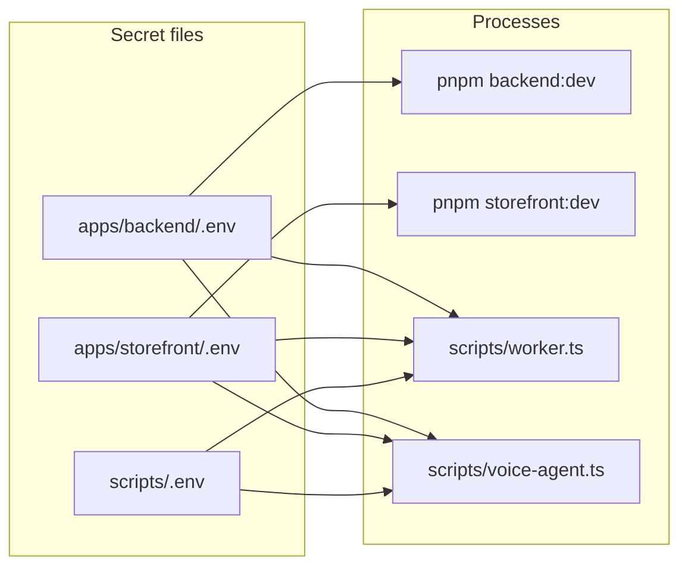
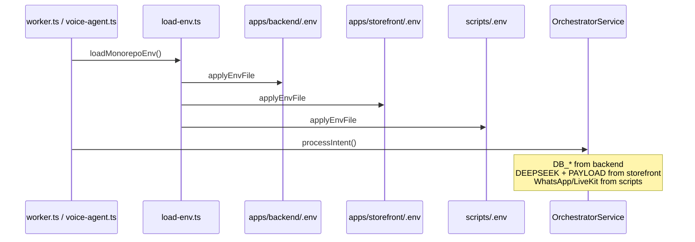

## Environment Configuration — Three-Runtime Secret Map

Aura splits secrets across **three `.env` files** — one per runtime boundary. Templates (committed) map to secret files (gitignored). Never commit `.env`.

| Template | Secret file | Primary process |
| --- | --- | --- |
| [`apps/backend/.env.template`](../../apps/backend/.env.template) | `apps/backend/.env` | Vendure (`pnpm backend:dev`) |
| [`apps/storefront/.env.template`](../../apps/storefront/.env.template) | `apps/storefront/.env` | Remix + Mastra (`pnpm storefront:dev`) |
| [`scripts/.env.template`](../../scripts/.env.template) | `scripts/.env` | Transport runners (`worker.ts`, `voice-agent.ts`) |

Quick root reference: [`ENV.md`](../../ENV.md).

---

### 1. Runtime Topology



**Rule:** Put a key in the file that owns the process that **first** needs it. Root scripts additionally inherit app env via [`scripts/load-env.ts`](../../scripts/load-env.ts) — do not duplicate `DB_*`, `DEEPSEEK_API_KEY`, or `PAYLOAD_DATABASE_URL` in `scripts/.env`.

---

### 2. First-Time Setup

```powershell
copy apps\backend\.env.template apps\backend\.env
copy apps\storefront\.env.template apps\storefront\.env
copy scripts\.env.template scripts\.env
```

Fill values on the right side of `=` (no quotes unless the value contains spaces). Shell-exported variables override file values.

---

### 3. `apps/backend/.env` — Vendure Commerce Server

Loaded by `import 'dotenv/config'` in [`apps/backend/src/index.ts`](../../apps/backend/src/index.ts). Also loaded into root scripts via `load-env.ts`.

| Variable | Purpose | Where to obtain |
| --- | --- | --- |
| `DB_HOST` | Postgres host | Local Postgres or [Neon](https://neon.tech) connection string |
| `DB_PORT` | Postgres port | Default `5432` |
| `DB_USER` | Postgres user | Your DB provider |
| `DB_PASSWORD` | Postgres password | Your DB provider |
| `DB_NAME` | Database name | Default `vendure` |
| `SUPERADMIN_USERNAME` | Vendure admin login | You choose (dev default in template) |
| `SUPERADMIN_PASSWORD` | Vendure admin password | You choose |
| `STORE_CORS` | Shop API CORS | Remix dev URL (`http://localhost:5173`) |
| `ADMIN_CORS` | Admin UI CORS | Admin + API origins |
| `AUTH_CORS` | Auth endpoint CORS | Same as admin |
| `JWT_SECRET` | Vendure JWT signing | Random string (`openssl rand -hex 32`) |
| `COOKIE_SECRET` | Vendure session cookies | Random string |
| `REDIS_URL` | Redis connection | Local `redis://localhost:6379` or hosted URL |
| `GOOGLE_API_KEY` / `GEMINI_API_KEY` | Backend Gemini config | [Google AI Studio](https://aistudio.google.com/apikey) |
| `WHATSAPP_VERIFY_TOKEN` | Backend webhook verify | **You invent** — must match storefront (§7) |

Consumed by: [`vendure-config.ts`](../../apps/backend/src/vendure-config.ts), [`config.ts`](../../apps/backend/src/config.ts), [`vector-search.plugin.ts`](../../apps/backend/src/plugins/vector-search/vector-search.plugin.ts), [`OrchestratorService`](../../apps/backend/src/domains/orchestrator/orchestrator.service.ts) (`DB_*`).

---

### 4. `apps/storefront/.env` — Remix Storefront + Mastra Concierge

Loaded by Vite/Remix at dev and build time. Also loaded into root scripts via `load-env.ts`.

| Variable | Purpose | Where to obtain |
| --- | --- | --- |
| `NODE_ENV` | Runtime mode | `development` locally |
| `VENDURE_API_URL` | Shop GraphQL endpoint | `http://localhost:3000/shop-api` when Vendure on 3000 |
| `SESSION_SECRET` | Remix cookie signing | Random string |
| `DEEPSEEK_API_KEY` | `shopAgent` LLM | [DeepSeek platform](https://platform.deepseek.com) |
| `PAYLOAD_DATABASE_URL` | Neon semantic cache / embeddings | Neon dashboard connection string |
| `WHATSAPP_VERIFY_TOKEN` | Webhook challenge verify | **Same value** as backend (§7) |
| `WHATSAPP_APP_SECRET` | Webhook HMAC verify | Meta Developer → App Secret |
| `OTEL_EXPORTER_OTLP_ENDPOINT` | Trace export (optional) | Default `http://localhost:4318/v1/traces` |

Consumed by: [`shopAgent.ts`](../../apps/storefront/app/mastra/agents/shopAgent.ts), [`cache-engine.server.ts`](../../apps/storefront/app/domains/ai-cache/cache-engine.server.ts), [`api.webhook.whatsapp.ts`](../../apps/storefront/app/routes/api.webhook.whatsapp.ts), GraphQL tools under `domains/`.

`OrchestratorService` dynamically imports `shopAgent` and `cache-engine` — worker and voice-agent **inherit** `DEEPSEEK_API_KEY` and `PAYLOAD_DATABASE_URL` from this file without copying them to `scripts/.env`.

---

### 5. `scripts/.env` — Transport Runners Only

Loaded last by [`scripts/load-env.ts`](../../scripts/load-env.ts). Keys here are **not** needed by Vendure or Remix directly.

| Variable | Purpose | Where to obtain |
| --- | --- | --- |
| `WHATSAPP_ACCESS_TOKEN` | Outbound Meta Graph API | Meta Developer → WhatsApp → API Setup |
| `WHATSAPP_PHONE_NUMBER_ID` | Sender phone number ID | Same Meta page |
| `LIVEKIT_URL` | WebRTC signal server | [LiveKit Cloud](https://cloud.livekit.io) → `wss://…` |
| `LIVEKIT_API_KEY` | LiveKit API key | Same project |
| `LIVEKIT_API_SECRET` | LiveKit API secret | Same project |
| `DEEPGRAM_API_KEY` | STT plugin | [Deepgram console](https://console.deepgram.com) |
| `CARTESIA_API_KEY` | TTS plugin | [Cartesia dashboard](https://play.cartesia.ai) |

Consumed by: [`scripts/worker.ts`](../../scripts/worker.ts) (WhatsApp outbound), [`scripts/voice-agent.ts`](../../scripts/voice-agent.ts) (LiveKit + speech pipeline). See [voice-agent-flow.md](./voice-agent-flow.md) and [session-memory.md](./session-memory.md).

---

### 6. `load-env.ts` Merge Order

Root scripts call `loadMonorepoEnv()` before any other imports that read `process.env`:

```text
1. apps/backend/.env
2. apps/storefront/.env
3. scripts/.env
```

Later files do **not** override keys already set in the shell or by an earlier file (first wins per key). This lets `OrchestratorService` inside worker/voice-agent reach Vendure Postgres (`DB_*`) and Mastra (`DEEPSEEK_API_KEY`) without duplicating secrets.



---

### 7. Dual-File Contract — `WHATSAPP_VERIFY_TOKEN`

WhatsApp verification uses the **same user-defined string** in two places:

| File | Consumer |
| --- | --- |
| `apps/backend/.env` | [`vector-search.plugin.ts`](../../apps/backend/src/plugins/vector-search/vector-search.plugin.ts) |
| `apps/storefront/.env` | [`api.webhook.whatsapp.ts`](../../apps/storefront/app/routes/api.webhook.whatsapp.ts) |

Meta's webhook configuration UI must use this identical token. This is **not** the App Secret (`WHATSAPP_APP_SECRET` — storefront only) and **not** the access token (`WHATSAPP_ACCESS_TOKEN` — scripts only).

---

### 8. Feature-Scoped Checklists

Enable only what you need:

| Goal | Required files / keys |
| --- | --- |
| Shop + Vendure locally | `apps/backend/.env`: `DB_*`, `JWT_SECRET`, `COOKIE_SECRET` · `apps/storefront/.env`: `VENDURE_API_URL`, `SESSION_SECRET` |
| AI concierge replies | + `DEEPSEEK_API_KEY` in **storefront** |
| Semantic cache / vector grounding | + `PAYLOAD_DATABASE_URL` in **storefront** |
| WhatsApp inbound webhooks | + `WHATSAPP_VERIFY_TOKEN` in **backend + storefront** (same value), `WHATSAPP_APP_SECRET` in **storefront** — see [webhook-pubsub.md](./webhook-pubsub.md) |
| WhatsApp outbound replies | + `WHATSAPP_ACCESS_TOKEN`, `WHATSAPP_PHONE_NUMBER_ID` in **scripts** · Redis running (`REDIS_URL` in backend) |
| LiveKit voice agent | + `LIVEKIT_*`, `DEEPGRAM_API_KEY`, `CARTESIA_API_KEY` in **scripts** — see [voice-agent-flow.md](./voice-agent-flow.md) |

**Recommended fill order (greenfield):**

1. Postgres `DB_*` → `apps/backend/.env`
2. Neon `PAYLOAD_DATABASE_URL` → `apps/storefront/.env`
3. `DEEPSEEK_API_KEY` → `apps/storefront/.env`
4. Random `JWT_SECRET`, `COOKIE_SECRET`, `SESSION_SECRET`
5. WhatsApp verify token (backend + storefront) → app secret (storefront) → access token + phone ID (scripts)
6. LiveKit + Deepgram + Cartesia → `scripts/.env`

---

### 9. Process Launch Matrix

| Command | Env files read |
| --- | --- |
| `pnpm backend:dev` | `apps/backend/.env` (dotenv) |
| `pnpm storefront:dev` | `apps/storefront/.env` (Vite) |
| `node … scripts/worker.ts` | backend → storefront → scripts (`load-env.ts`) |
| `node … scripts/voice-agent.ts dev` | backend → storefront → scripts (`load-env.ts`) |

```powershell
# Terminal 1 — guardrails
pnpm verify-agent

# Terminal 2 — Vendure
pnpm backend:dev

# Terminal 3 — Remix
pnpm storefront:dev

# Terminal 4 — WhatsApp worker (optional)
node --no-warnings --experimental-strip-types scripts/worker.ts

# Terminal 5 — Voice agent (optional)
node --no-warnings --experimental-strip-types scripts/voice-agent.ts dev
```

Full infrastructure prerequisites (Postgres, Redis, Ollama, Jaeger OTLP), seed steps, demo test scripts, and telemetry verification: [demo-runbook.md](./demo-runbook.md).

---

### 10. Do Not Duplicate

| Variable | Set once in | Scripts inherit? |
| --- | --- | --- |
| `DB_*` | `apps/backend/.env` | Yes |
| `DEEPSEEK_API_KEY` | `apps/storefront/.env` | Yes |
| `PAYLOAD_DATABASE_URL` | `apps/storefront/.env` | Yes |
| `WHATSAPP_VERIFY_TOKEN` | backend **and** storefront (same value) | N/A — not in scripts |
| `WHATSAPP_ACCESS_TOKEN` | `scripts/.env` only | No |
| `LIVEKIT_*`, `DEEPGRAM_API_KEY`, `CARTESIA_API_KEY` | `scripts/.env` only | No |
