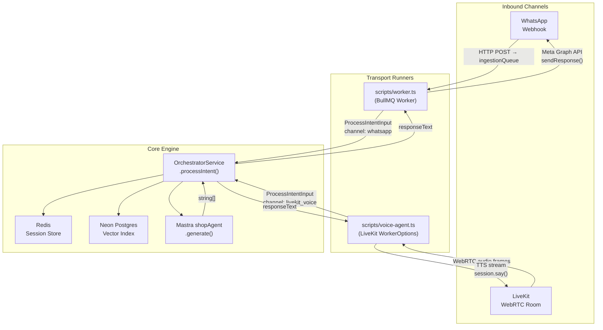
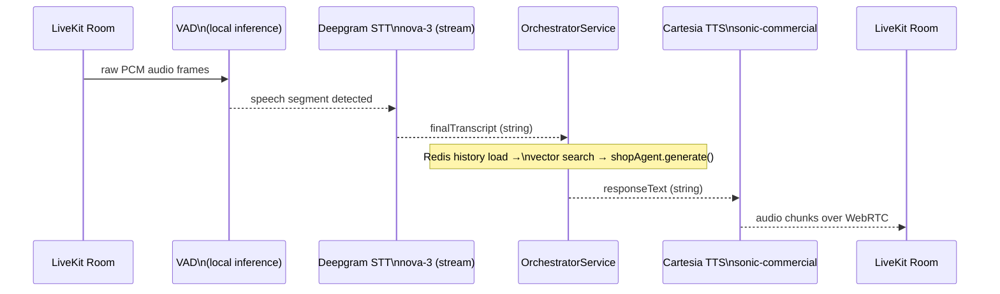
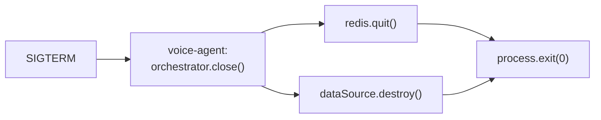

## LiveKit Voice Agent — Real-Time Audio Pipeline

`scripts/voice-agent.ts` is a long-lived Node.js process that connects to a LiveKit room, runs a local VAD loop, and delegates all AI resolution to the same [`OrchestratorService`](../../apps/backend/src/domains/orchestrator/orchestrator.service.ts) that the BullMQ worker uses. It is structurally parallel to [`scripts/worker.ts`](../../scripts/worker.ts) — a thin transport runner, not a business logic host.

---

### 1. Channel Topology

---

### 2. Real-Time Audio Frame Pipeline

---

### 3. Session Identity Isolation

The voice agent passes the remote participant's `identity` (via `ctx.waitForParticipant()`) as `platformUserId`. This is the same key scheme the Redis session store uses to namespace multi-turn history, so voice sessions are stored separately from WhatsApp sessions — no cross-channel bleed.

| Channel | `platformUserId` source | Redis key prefix |
|---|---|---|
| `whatsapp` | `payload.metadata.sender` | `session:whatsapp:<id>` |
| `livekit_voice` | `participant.identity` (remote user) | `session:livekit_voice:<id>` |

---

### 4. Graceful Shutdown Sequence

---

### 5. AST Firewall Gate Mapping

The file is added to the AST firewall default sweep. Relevant rules enforced at compile time:

| Rule | Constraint | How voice-agent.ts satisfies it |
|---|---|---|
| 14 | No naked `fetch`/`axios` outside Zod parse | All network inside `@livekit/agents` SDK boundaries |
| 19 | No explicit `any` on params or variables | `error: unknown` + `instanceof Error` guard |
| 20 | No `z.any().parse()` bypass | No Zod usage in this file at all |

---

### 6. Required Environment Variables

LiveKit, Deepgram, and Cartesia keys live in `scripts/.env`. `OrchestratorService` inherits `DB_*`, `DEEPSEEK_API_KEY`, and `PAYLOAD_DATABASE_URL` from app env files via [`scripts/load-env.ts`](../../scripts/load-env.ts). Full key map: [environment-config.md](./environment-config.md).
